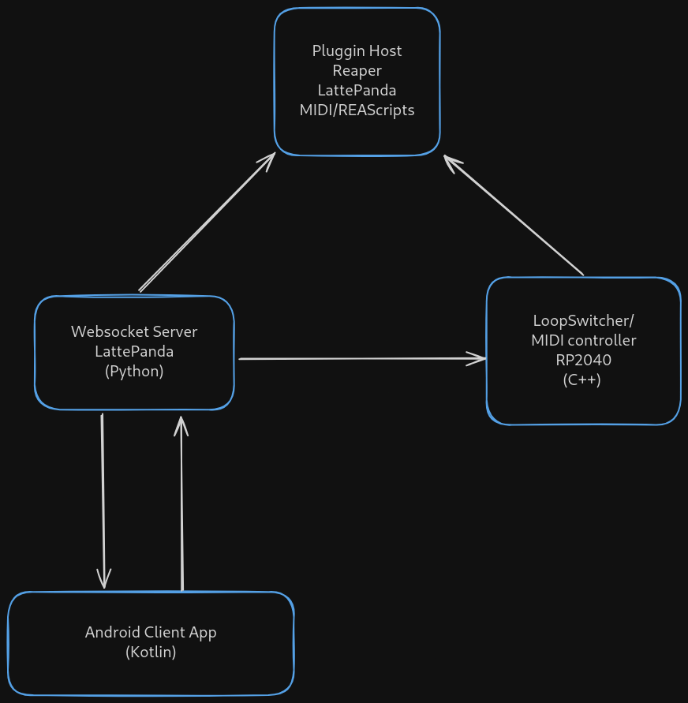

# Conception

## Architecture

- Gestion des composantes analogiques et numériques d'un signal audio

- Interface permettant l'utilisateur d'avoir les mains libres quand il l'itilise

- Configuration des différents paramètres des programmes via une application mobile

## Choix technologiques

- Utilisation de relais avec optocopler pour avoir un "True Bypass" dans les cirquits désactivé

- Prototypage du circuit analogique sur arduino vu la facilicté d'accès

- Utilisation du 74HC595 pour multiplier les entrées sorties du micro-controlleur

- Application mobile pour configurer l'interface car la majorité des utilisateur en ont un sur eux.

- Utilisation de webSocket pour le serveur pour éviter les délais

## Modèles et diagrammes

  

## Prototype

