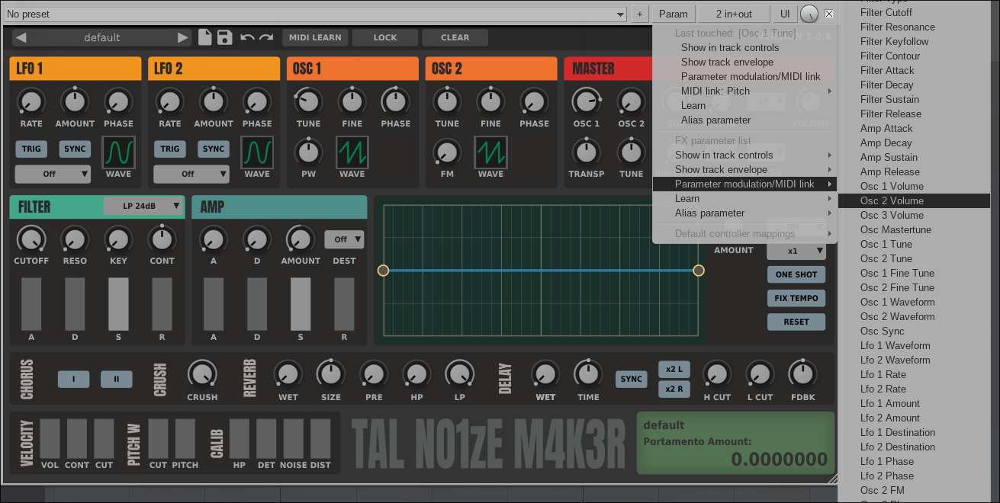
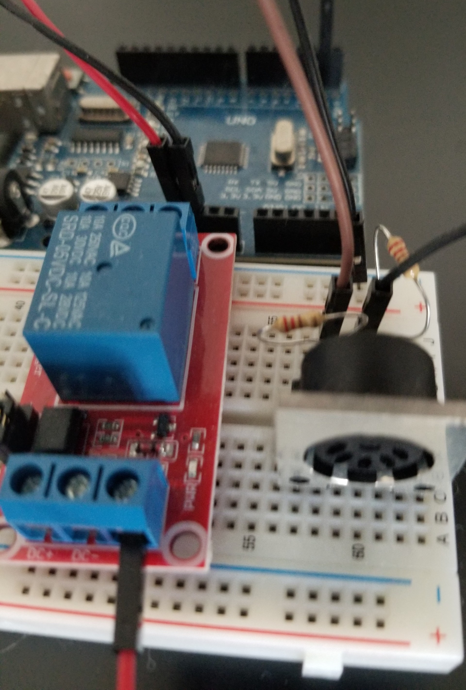

# Projet IFT3150: Plateforme de traitement de signaux audio analogique et numérique

> **Thèmes**: Systèmes Embarqués, Micro-Contrôlleur  
> **Superviseur**: Louis Edouard Lafontant (Autres -> *pending*)  
> **Collaborateurs:** Nom de(s) collaborateur(s) et partenaire(s)  

## Informations importantes

!!! info "Dates importantes"
    - **Description du projet** : 28 septembre 2025
    - **Foire 1: Prototypage** : 6-10 octobre 2025
    - **Foire 2: Version beta** : 3-7 novembre 2025
    - **Présentation et rapport** : ?  2025

## Équipe

- Louis-Pierre Bastien

## Description du projet

### Contexte

### Problématique ou motivations

Avec les progrès fait dans le domaine de l&rsquo;audio numérique, de plus
 en plus de solutions digitales s&rsquo;offrent aux musiciens (simulateur
 d&rsquo;amplificateur, d&rsquo;éffets sonores). Mais les solutions analogue offrent
 des options qui ne sont parfois pas accessibles autrement. Or un usager pourrait
 vouloir avoir une partie de son signal qui est traité de manière analogique
 et l&rsquo;autre de manière numérique. Quand un musicien performe, il n&rsquo;a pas
 le temps de pèser sur plusieurs boutons pour changer le chemin qu&rsquo;emprunte
 son signal ou de cliquer avec une souris sur son ordinateur pour changer
 les paramètres des instruments virtuels ou plugins qu'il utilise.  

### Proposition et objectifs

On propose de développer une plateforme qui permetterait de gêrer à la fois la partie analogique (via un "loopswitcher" et la partie numérique (via l'envoi de signaux MIDI) et d'héberger les logigiels de traitement de signaux numériques de sorte que le musicien pourrait accèder aux sons qu'il désire en n'ayant qu'à peser sur un boutton. Le rootage des signaux serait sauvegardé par l'utilisateur sous forme de programmes (un programme pourrait par exemple enchaîner en succession les différents sons nécessaire pour interpréter une pièce musicale en appuyant sur le même boutton).    

### Traitement des signaux analogues

-   Loopswitcher

    Les effets analogique seraient toujours à &rsquo;ON&rsquo; et on choisirait
    par où le signal passe à l&rsquo;aide de relais (ou transistors) et
    d&rsquo;un microcontrolleur et d&rsquo;un boutton avec lequel l&rsquo;utilisateur
     ineragit (switch ou potentiomètre) pour en &rsquo;allumer ou éteindre&rsquo;
     plusieurs à la fois.
    
    
    
    

### Traitement de la partie digitale

Les moyens d&rsquo;interaction (boutons ou potentiomètres) étant
liés au microcontrolleur, pourront &rsquo;trigger&rsquo; l&rsquo;envoi de
signaux MIDI pour changer les paramètres des effets digital.

### Hébergement de plugins de traitement de son digital sur le hardware

L&rsquo;hébergement de logiciels de traitement sonore à même le dispositif permettrait
aux usagers de ne plus dépendre d&rsquo;un ordinateur pour la partie de traitement digitale,
des solutions similaires existent déjà pour ce genre de chose, mais elles sont de nature
propriétaire et ne laissent aux usagers que les choix offerts par la compagnie.
La solution qu&rsquo;on propose serait moins contraignante et open source.

## Hardware
Pour la conception de la partie de traitement de signal numérique, des contraintes de temps existent pour la conversion analogique vers numérique, le traitement du signal numérique et la reconversion numérique vers analogique (vers une sortie telle que des écouteurs ou des haut parleurs) ce faisant, une carte FPGA est envisagée pour le développement.

### Microcontrolleur

Pour le controlle analogique, dans la phase de prototypage un arduino est envisagé, mais 
un circuit imprimé sur mesure serait probablement mieux au final.

## Software

Fournir une interface intuitive pour que l&rsquo;utilisateur puisse
configurer/modifier le comportement du dispositif/des actions
exécutée en fonction des inputs qu&rsquo;il donne (ex. appuyer sur
un bouton -> changement de programme/mettre un loop à off ou
envoyer un signal MIDI).

## Modularité

Un avenue qui pourrait être intéressante serait de rendre le
hardware modulaire de sorte que si l&rsquo;utilisateur veut par exemple
ajouter plus de &rsquo;loops&rsquo; à son dispositifs ou différents moyens d&rsquo;intéractions
(boutons ou potentiomètres) ça pourrait se faire de manière &rsquo;plug and play&rsquo;.

# Autres utilités

-   Le projet est présenté avec un guitariste comme usager, mais un claviériste pourrait
    tout aussi bien utiliser un dispositif semblable pour ajouter plus de contrôles à un
    clavier existant (potentiomètres pour influencer la fréquences d&rsquo;un égalisateur) switch pour
    tourner les pages d&rsquo;une partition sur une tablette&#x2026, storer des instruments virtuels;

## Échéancier

!!! info
    Le suivi complet est disponible dans la page [Suivi de projet](suivi.md).

| Jalon (*Milestone*)            | Date prévue   | Livrable                            | Statut      |
|--------------------------------|---------------|-------------------------------------|-------------|
| Ouverture de projet            | 1 mai         | Proposition de projet               | ✅ Terminé  |
| Analyse des exigences          | 16 mai        | Document d'analyse                  | 🔄 En cours |
| Prototype 1                    | 23 mai        | Maquette + Flux d'activités         | ⏳ À venir  |
| Prototype 2                    | 30 mai        | Prototype finale + Flux             | ⏳ À venir  |
| Architecture                   | 30 mai        | Diagramme UML ou modèle C4          | ⏳ À venir  |
| Modèle de donneés              | 6 juin        | Diagramme UML ou entité-association | ⏳ À venir  |
| Revue de conception            | 6 juin        | Feedback encadrant + ajustements    | ⏳ À venir  |
| Implémentation v1              | 20 juin       | Application v1                      | ⏳ À venir  |
| Implémentation v2 + tests      | 11 juillet    | Application v2 + Tests              | ⏳ À venir  |
| Implémentation v3              | 1er août      | Version finale                      | ⏳ À venir  |
| Tests                          | 11-31 juillet | Plan + Résultats intermédiaires     | ⏳ À venir  |
| Évaluation finale              | 8 août        | Analyse des résultats + Discussion  | ⏳ À venir  |
| Présentation + Rapport         | 15 août       | Présentation + Rapport              | ⏳ À venir  |
